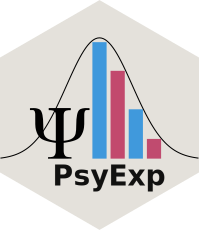

# **PsyExp**

 
 
 
 
 
 
 

The aim of this repository is collecting different functions useful during **Experimental Psychology** workflows. Usually we perform similar operations across experiments or different projects such as calculating distance and visual angles, manipulating images for stimuli. The idea is to collect and organize in an useful way several functions and general code for dealing with these operations.  
The final goal is creating an `R Package` for working in the same environment with the same language. However, for now, this repository contain also other functions from other programming languages.

# Table of Contents

  - [Functions](#functions)
    - [Oval Crop](#oval-crop)

## Functions

### Oval Crop

`Oval Crop` is a **MATLAB** script for automatically crop all images in the working directory. The circle is user defined based on `x, y, width and height` values. User have to defined `cirle parametres` and the input `images extension` (for example `.png`) and then run the script. A new folder `Cropped Images` will be created with all cropped images inside, with `.png` for having the trasparency.